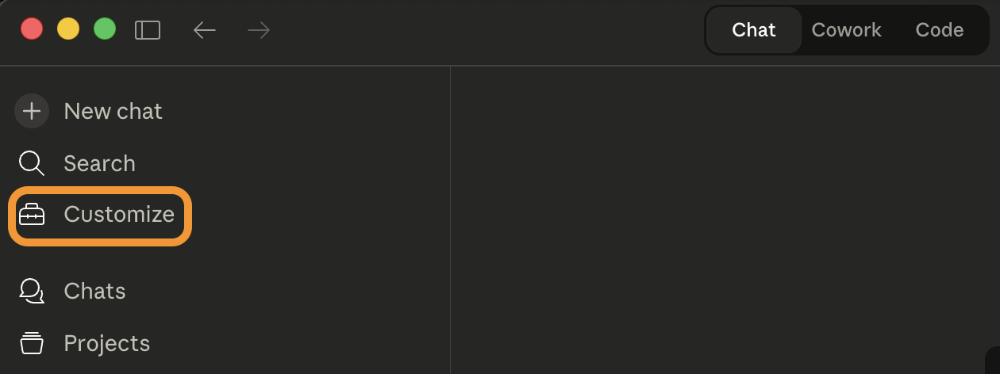
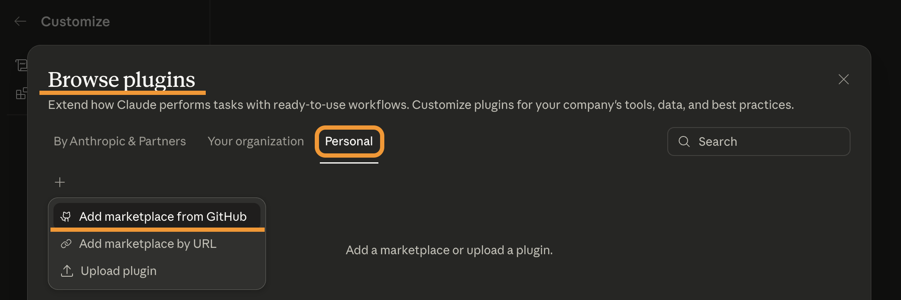
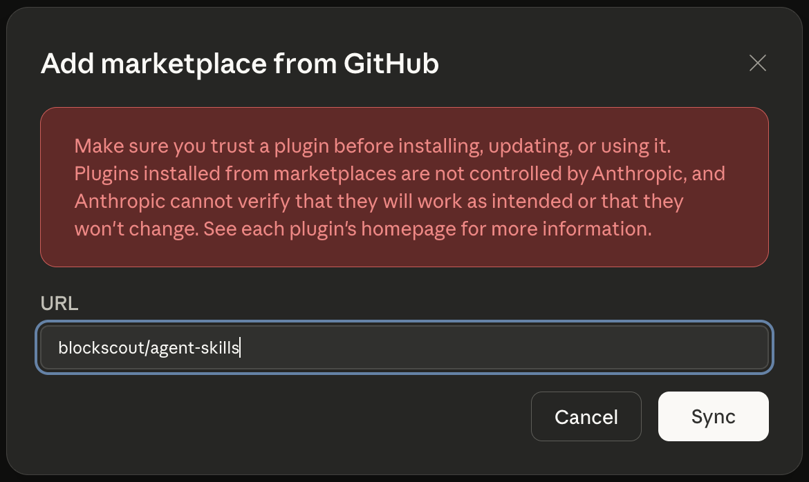
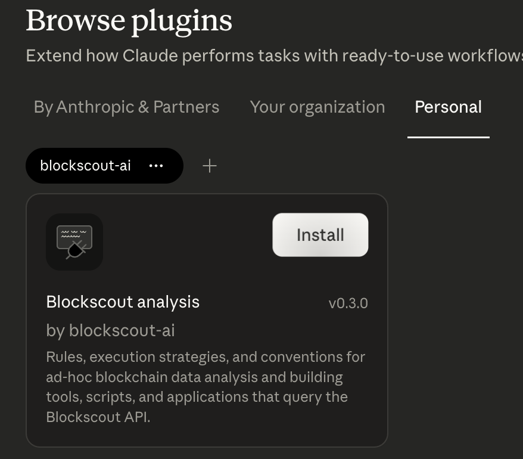
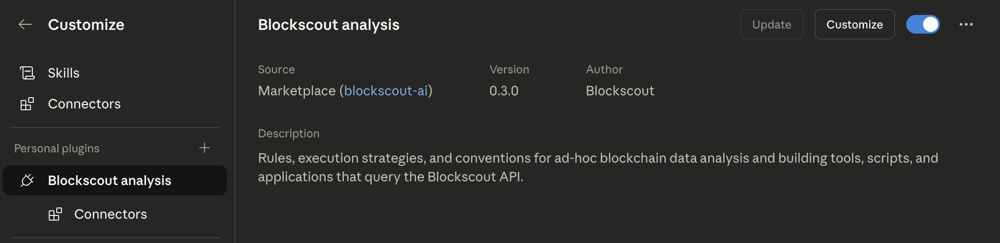
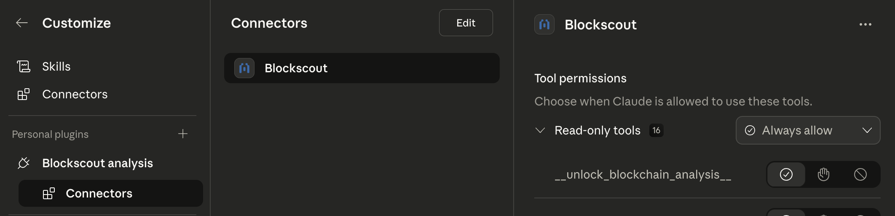

# Blockscout Agent Skills

A collection of AI agent skills for working with the Blockscout ecosystem — blockchain explorers, APIs, and supporting services.

Each skill is a self-contained directory of structured instructions and helper scripts that give an AI agent domain expertise in a specific area. Skills follow the markdown-based format compatible with Claude Code, Codex, Cursor, OpenClaw, Claude Cowork, and other agents that support skill/instruction loading.

## Skills

| Skill | Description |
|-------|-------------|
| [blockscout-analysis](blockscout-analysis/) | Modular skill for blockchain data analysis and scripting using the Blockscout MCP Server. Guides agents to use native tools, REST API scripts, or hybrid flows for multi-chain EVM data. |

## Setup

Each skill is a directory with a `SKILL.md` entry point and supporting docs/scripts. Integration depends on your agent platform — see examples below.

### Claude Code

No separate MCP server configuration needed — it is set up automatically as part of the plugin installation.

```sh
claude plugin marketplace add blockscout/agent-skills
claude plugin install blockscout-analysis@blockscout-ai
```

### Claude Desktop (Chat / Cowork / Code)

Must be configured separately for Chat/Cowork and for Code by the same procedure.

1. Choose **Customize** in the sidebar:

   

2. Choose **Browse plugins** → **Personal** → **Add marketplace from GitHub**:

   

3. Enter the GitHub repo ID `blockscout/agent-skills` and press **Sync**:

   

4. The marketplace **blockscout-ai** will appear in the list of Personal plugins. Click **Install** on the Blockscout analysis plugin:

   

5. Once installed, the plugin details are available in the **Customize** window:

   

6. If the plugin has MCP servers associated, their info will be available in the **Connectors** sub-item:

   

### Gemini CLI

```sh
gemini mcp add --transport http blockscout https://mcp.blockscout.com/mcp
gemini skills install https://github.com/blockscout/agent-skills --path blockscout-analysis
```

### Codex CLI / Codex App

Configure the MCP server first. For Codex App: **Settings** → **MCP Servers** → **Add server**.

```sh
codex mcp add blockscout --url https://mcp.blockscout.com/mcp
```

Then run `codex` and prompt:

```plaintext
$skill-installer Install the skill from https://github.com/blockscout/agent-skills, path `blockscout-analysis`
```

Restart Codex to pick up the skill. Before prompting, make sure that either `network_access` is allowed for the sandbox or "Full access" is granted.

## Updating

The skills and the underlying Blockscout infrastructure are under continuous development. Update the marketplace/plugin (Claude) or re-install the skill (Gemini, Codex) periodically to pick up the most recent versions.

## Packaging

To create a distributable zip of a skill:

```sh
bash tools/package.sh <skill-directory>
```

This produces `<skill-directory>-<version>.zip` and `<skill-directory>-<version>.skill` (version read from `SKILL.md` frontmatter) containing all tracked files except `.gitignore` and `README.md`. The `.skill` file is identical to the `.zip` but uses the extension recognised by Claude Desktop and Gemini CLI for one-click import.

## License

[MIT](LICENSE)
